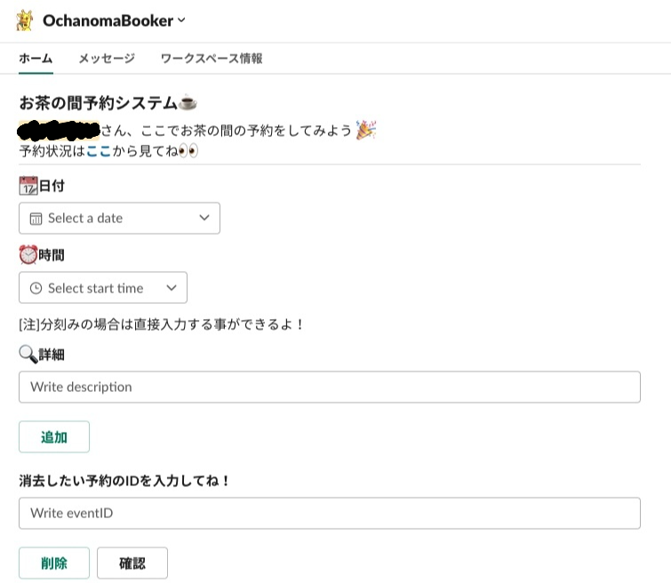
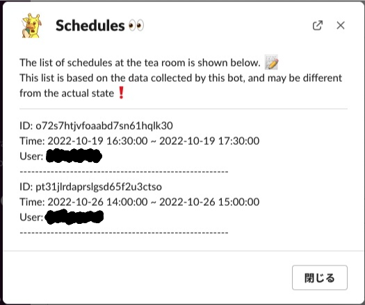

# OchanomaBookerの使い方

## 概要
研究室のお茶室のスケジュールを管理するSlackアプリです。
現在はお茶の間が消失したため、621の会議室のスケジュールを管理しています。
Google Calendar上でもスケジュールの確認・削除ができます。

## 導入方法
slackのAppから"OchanomaBooker"を選択します。

## 使い方
基本的にホームタブから使用します。

### 予定追加時
日付と開始時刻・終了時刻を選択し、伝えたいことがあれば詳細に記入できます。
終了時刻を入力しなかった場合は開始時刻から1時間後まででスケジュールに登録されます。
最後に追加ボタンを押すと、予定が追加されます。
アプリから追加すると#お茶室予約 に予約したことが通知されます。
誰かが先に予定を入れていた際には予約ができないようになっています。

### 予定確認時
削除ボタンの横にある確認ボタンを押すと、予定の確認ができます。
30日後までの予定のみ表示されます。

### 予定削除時
予約確認時に表示された予定のIDを入力し、削除ボタンを押すと予定が削除されます。
予約をした際に送信されたチャット横にあるdeleteボタンを押すとその予定が削除されます。

~~隠しコマンド~~
- メッセージで"hello"と打つと…

## その他
もし、botが動いていない時はGoogle Calendarにアクセスして入力してください。

その他の要望，不具合等があれば，ご連絡ください！

実装コードは[ここ](https://github.com/miiiu10/ocha-room)にあります。もし一緒に開発したい！という人がいたら気軽に声をかけてください。